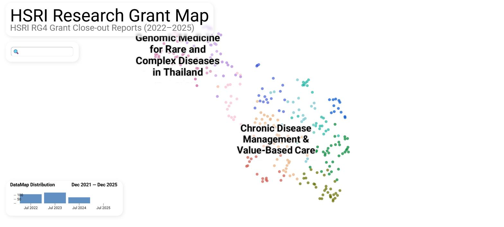
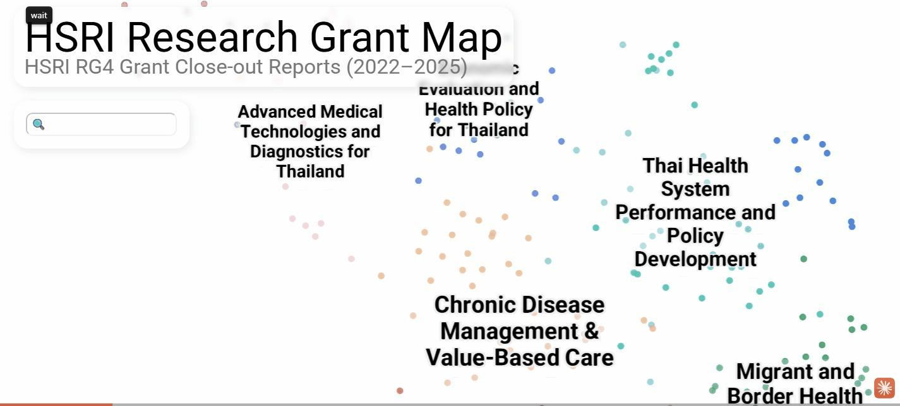

# HSRI Research Grant Map

An interactive visualization exploring the research landscape funded by the Health Systems
Research Institute (HSRI / สวรส.) of Thailand, built from RG4 grant close-out reports
covering fiscal years 2022–2025.

[🗺️ Explore the visualization](https://diamondjaja.github.io/hsri-research-map) (recommended using Google Chrome on desktop)

### Overview

This project visualizes the structure of 318 HSRI-funded health systems research projects,
revealing thematic clusters — from genomic medicine and infectious disease to health policy,
pharmaceutical systems, and primary care — and how they relate to each other. Source project
reports are in Thai; the visualization surfaces English summaries, key findings, and impact
dimensions (policy / academic / social / economic) for each project. The visualization employs
dimensionality reduction and clustering techniques inspired by
[The Illustrated NeurIPS 2025](https://newsletter.languagemodels.co/p/the-illustrated-neurips-2025-a-visual).

### Methodology

1. **Consolidate project data** — Each project's already-extracted structured fields
   (objectives, results, findings, policy use, utilization) are consolidated into a clean
   bilingual summary and tags using an LLM ([`google/gemini-2.5-flash`](https://openrouter.ai/google/gemini-2.5-flash)
   via [OpenRouter](https://openrouter.ai/)) — composing and tagging, not extracting from
   scratch, since the source reports were already OCR'd and field-extracted upstream.
2. **Embed projects** — Build a bilingual (English-first, Thai-second) embedding text per
   project and encode it with Cohere's [`embed-multilingual-v3.0`](https://docs.cohere.com/docs/embeddings).
3. **Reduce dimensionality** — Project the embeddings with [UMAP](https://github.com/lmcinnes/umap)
   (cosine metric) twice, for two different purposes:
   - **10D** (`n_neighbors=15`, `min_dist=0.0`) — a tighter space used only for clustering
   - **2D** (`n_neighbors=30`, `min_dist=0.1`) — the spread-out layout actually plotted
4. **Cluster and name** — Run [HDBSCAN](https://scikit-learn.org/stable/modules/generated/sklearn.cluster.HDBSCAN.html)
   on the 10D coordinates (`min_cluster_size=8`, Euclidean distance, EOM cluster selection),
   then reassign any points HDBSCAN leaves as noise to their nearest real cluster via a kNN
   classifier trained on the core (non-noise) points, so every project ends up in a cluster.
   Each of the resulting 12 clusters is then named (short title + one-line description) by an
   LLM, using its 15 most-central projects — by distance to the cluster's centroid — as context.
5. **Visualize** — Plot the 2D layout, colored and labeled by cluster, as an interactive
   [`datamapplot`](https://datamapplot.readthedocs.io/en/latest/) (deck.gl) scatter plot, with
   a bilingual EN/TH tooltip (hover to preview, click to pin open) and a year histogram.

In short: **LLM consolidation → bilingual embedding → two UMAP projections (clustering vs.
layout) → HDBSCAN + kNN noise cleanup → LLM cluster naming → interactive plot.**

Pipeline code lives in [`scripts/hsri/`](scripts/hsri/); see [`task.md`](task.md) for detailed
notes on the adaptation from the original MUREX (Scopus paper) pipeline.
